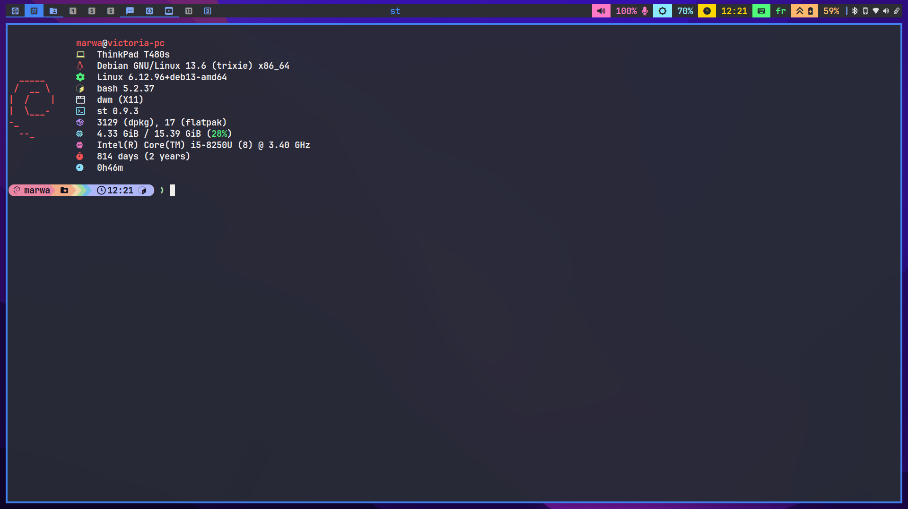

<div align="center">

# marwatoo/dwm

**A personalized build of [dwm](https://dwm.suckless.org) 6.6 — the dynamic window manager**

*Gaps · Systray · RTL/Arabic support · Fibonacci layouts · Custom AI-assisted patches*




</div>

---

## About

This is my personal fork of **dwm**, patched by hand and with the help of AI (mainly inside `dwm.c` and `drw.c`) to fit my daily workflow: Arabic/RTL text support in the bar, gaps, a system tray, custom stack rotation, and several quality-of-life tweaks that vanilla dwm doesn't ship with.

It's not meant to be a general-purpose distribution — it's tuned for my machine, my fonts, and my keybindings — but everything below is documented so you (or future me) can understand exactly what changed and why.

---

## Table of Contents

- [Patches & Features](#patches--features)
- [Requirements](#requirements)
- [Installation](#installation)
- [Running dwm](#running-dwm)
- [Configuration](#configuration)
- [Keybindings](#keybindings)
- [Repository Layout](#repository-layout)
- [Companion Tools / Ecosystem](#companion-tools--ecosystem)
- [Related Repositories](#related-repositories)
- [Credits](#credits)

---

## Patches & Features

Every item below was verified directly against the source (`dwm.c`, `drw.c`, `config.h`) — not assumed. Items marked **Custom/AI-assisted** are original modifications written for this build rather than ported from suckless.org's official patch list.

### Layout & Window Management

| Patch | Description |
|---|---|
| **Gaps (`gappx`)** | Configurable pixel gaps between tiled windows, tracked per-monitor via `m->gappx`. |
| **Pertag** | Each tag remembers its own layout, `mfact`, and `nmaster` independently (`struct Pertag`). |
| **Fibonacci layouts** | Adds `dwindle` and `spiral` arrangements on top of the stock `tile`/`monocle`/floating layouts. |
| **Rotate Stack** (AI-assisted) | `rotatestack()` cycles the tiled client order forward/backward (bound to `MOD+s` / `MOD+d`), built on custom `enqueue()`, `enqueuestack()`, and `prepend()` helpers. |
| **Shift View / Shift Tag** | `shiftview()` / `shifttag()` let you cycle to the adjacent tag or move a client to it (`MOD+←/→`, `MOD+SHIFT+←/→`). |
| **Aspect Resize** (AI-assisted) | `aspectresize()` resizes the focused floating window while preserving its current aspect ratio (`MOD+CTRL+h/l`). |
| **Lock Fullscreen** | `lockfullscreen` keeps focus pinned to a fullscreen client instead of leaking to others. |
| **Focus on Wheel toggle** | `focusonwheel` lets you disable focus-follows-scroll on mouse wheel events. |
| **i3 layout** (AI-assisted) | `i3layout` arrangement. |

### Bar & Visuals

| Patch | Description |
|---|---|
| **System Tray** | Full systray implementation (`Systray` struct, `updatesystray()`, XEMBED handling) with `systraypinning`, `systrayonleft`, and `systrayspacing` options. |
| **Bar Padding (vanity gaps)** | `vertpad` / `sidepad` add vertical and horizontal breathing room around the bar. |
| **Colored / Scriptable Status Bar** | `drawstatusbar()` renders the status text with custom drawing logic instead of the stock single-color `drawbar` text path. Status text is fed by either [marwatoo/slstatus](https://github.com/marwatoo/slstatus) or [marwatoo/dwmblocks](https://github.com/marwatoo/dwmblocks), switched between depending on need. |
| **Underline Tags** | Active/urgent tags are rendered with an underline accent instead of (or alongside) a filled background, controlled by `ulinestroke` and `ulinevoffset` and dedicated color schemes (`SchemeTagUnderline`, `SchemeTagUrgUnderline`, `SchemeTagUnderlineSel`). |
| **Extended Color Schemes** | Beyond stock `SchemeNorm`/`SchemeSel`, adds `SchemeTitle`, `SchemeTag`, `SchemeTagSel`, `SchemeTagUrg`, and `SchemeTagEmpty` for fully independent tag/title styling. |
| **Multiple Theme Palettes** | Ready-made Breeze Dark, Dracula, and Vimix (light & dark) color palettes defined in `config.h`, swappable via the `colors[]` mapping. |

### Internationalization

| Patch | Description |
|---|---|
| **RTL / Arabic Text Rendering** (AI-assisted) | `apply_fribidi()` runs bar text through **FriBidi** (`fribidi_log2vis`) before rendering, so Arabic and other right-to-left scripts display correctly instead of reversed/broken. Paired with Arabic-capable fonts (`Noto Sans Arabic`) and an emoji fallback font (`Noto Emoji`) in the font stack. |

### System / Session

| Patch | Description |
|---|---|
| **Autostart** | An `autostart[]` command array (`config.h`) is executed on startup via `autostart_exec()`, and every spawned PID is tracked and killed cleanly on `dwm` exit. |

---

## Requirements

To build this version of dwm you'll need:

- `libx11-dev`
- `libxinerama-dev`
- `libxft-dev`
- `libfreetype6-dev`
- `libfribidi-dev` — required for the RTL/Arabic text patch
- `build-essential`

## Installation

```bash
git clone https://github.com/marwatoo/dwm.git
cd dwm
```

Edit `config.mk` to match your local setup (dwm installs into `/usr/local` by default), then build and install:

```bash
sudo make clean install
```

## Running dwm

Add this to your `.xinitrc` to launch with `startx`:

```bash
exec dwm
```

To target a specific display:

```bash
DISPLAY=foo.bar:1 exec dwm
```

The bar's status text comes from an external program feeding `xsetroot -name`. This build is switched between two setups depending on need:

- **[marwatoo/slstatus](https://github.com/marwatoo/slstatus)** — a custom-built [slstatus](https://tools.suckless.org/slstatus/), lightweight, polls system info directly.
- **[marwatoo/dwmblocks](https://github.com/marwatoo/dwmblocks)** — modular, block-based, updates individual segments on signal.

Only one should be running in `autostart` at a time. Example using slstatus-style polling:

```bash
while xsetroot -name "`date` `uptime | sed 's/.*,//'`"
do
    sleep 1
done &
exec dwm
```

## Configuration

All configuration lives in `config.h` and is applied at compile time:

```bash
sudo make clean install
```

Key sections worth knowing about:

- **`fonts[]`** — font stack: monospace primary, Arabic fallback, emoji fallback.
- **`colors[]`** — active theme; swap in any of the Breeze Dark / Dracula / Vimix palettes defined above it.
- **`autostart[]`** — programs launched on session start (compositor, wallpaper, tray apps, etc.).
- **`rules[]`** — per-application tag/floating/monitor placement.
- **`layouts[]`** — order and icons for `dwindle`, `tile`, `monocle`, floating, `spiral` and `i3layout`.

## Keybindings

<details>
<summary><b>Click to expand full keybinding table</b></summary>

`MODKEY` = <kbd>Super</kbd> (Windows key)

| Keys | Action |
|---|---|
| `MOD + Return` | Open terminal (`ghostty`) |
| `MOD + SHIFT + Return` | Open secondary terminal (`xfce4-terminal`) |
| `MOD + r` | Toggle bar |
| `MOD + ←` / `→` | Shift view to adjacent tag |
| `MOD + SHIFT + ←` / `→` | Shift focused client to adjacent tag |
| `MOD + j` / `k` | Focus next/previous window |
| `MOD + h` / `g` | Decrease/increase master area size |
| `MOD + s` / `d` | Rotate stack backward/forward |
| `MOD + CTRL + j` / `k` | Increase/decrease number of masters |
| `MOD + CTRL + h` / `l` | Aspect-ratio resize (floating windows) |
| `MOD + Tab` | View previously selected tag |
| `MOD + ALT + c` | Kill focused client |
| `MOD + ALT + s/d/f/m/i` | Set layout: dwindle / tile / monocle / floating / i3 |
| `MOD + Space` | Cycle layout |
| `MOD + SHIFT + Space` | Toggle floating |
| `F1`–`F10` | View tag 1–10 |
| `SHIFT + F1`–`F10` | Move client to tag 1–10 |
| `Print` | Screenshot (`flameshot gui`) |
| `MOD + q` | App launcher (rofi) |
| `MOD + l` | Power menu (rofi) |
| `MOD + w` / `SHIFT + w` | Browser / browser picker |
| `MOD + e` / `SHIFT + e` | File manager / file search |
| `MOD + u` | VS Code |
| `MOD + x` / `CTRL + x` / `SHIFT + x` / `ALT + x` | Text editors (xed / nvim / custom / kate) |
| `MOD + b` | Obsidian |
| `MOD + y` | Window switcher script |
| `XF86 Volume/Brightness/Mute keys` | Media & brightness control via `pactl` / `brightnessctl` |

</details>

## Repository Layout

```
.
├── config.h          # User configuration (keys, rules, theme, autostart)
├── config.mk          # Build-time configuration (paths, flags)
├── dwm.c              # Core window manager logic + custom patches
├── drw.c / drw.h       # Drawing/font/color abstraction library
├── transient.c         # Transient window helper
├── util.c / util.h     # Shared utility functions
├── keys.sh             # Keybinding reference/helper script
├── dwm.1               # Man page
├── dwm.png             # Screenshot
└── screen.png           # Desktop screenshot
```

## Companion Tools / Ecosystem

dwm intentionally does very little on its own — no menus, tray, notifications,
or session handling. Here's the full stack of tools this build is meant to be
paired with, and where each one comes from on Debian 13 (trixie).

### Menus

- **Rofi** — used for all menus (app launcher, power menu, etc), based on
  scripts from [adi1090x/rofi](https://github.com/adi1090x/rofi)

### Tray / applets

- **xfce4-notifyd** — notifications
- **nm-tray** — network tray
- **xfce4-screensaver** — screensaver
- **xfce4-power-manager** — power management
- **pnmixer** — volume tray icon
- **blueman-applet** — bluetooth tray
- **xfce4-clipman** — clipboard tray icon
- **lxpolkit** — polkit agent, handles root password prompts for GUI apps
- **kdeconnect indicator** — tray indicator for KDE Connect

### Appearance / input

- **lxappearance** — GTK theme/icon/font appearance settings
- **libinput-gestures** + **libinput-gestures-setup** — touchpad gestures
  ([bulletmark/libinput-gestures](https://github.com/bulletmark/libinput-gestures))
- **picom** — compositor
- **nitrogen** — wallpaper manager

### File managers

- **Thunar** — default file manager
- **[Superfile](https://superfile.dev/)** — terminal-based alternative to Thunar

### Misc apps

- **webapp-manager** (Linux Mint)(http://packages.linuxmint.com/pool/main/w/webapp-manager/webapp-manager_1.4.6_all.deb)  — create desktop web apps
- **Xed** (Linux Mint)(http://packages.linuxmint.com/pool/backport/x/xed/xed_3.8.9+gigi_amd64.deb) — GUI text editor

### Terminals

- **st** — default terminal (this repo also includes the custom fribidi-based
  Arabic shaping/bidi patch used for RTL rendering)
- **ghostty** — used alongside Superfile for image previews
- **xfce4-terminal** — fallback terminal if st doesn't behave as expected

### Fonts

- **JetBrainsMono Nerd Font (NFP)** — UI font, includes glyphs/icons for tags
- **Symbola** — emoji support
- **Noto Sans Arabic** — Arabic script support

### Installing the ecosystem on Debian 13

Most of these are available directly via `apt`:

```bash
sudo apt update
sudo apt install \
  rofi \
  xfce4-notifyd \
  xfce4-screensaver \
  xfce4-power-manager \
  blueman \
  xfce4-clipman \
  lxpolkit \
  lxappearance \
  libinput-gestures \
  picom \
  nitrogen \
  thunar \
  xfce4-terminal \
  fonts-symbola \
  fonts-noto-core
```

The following are **not** in the standard Debian repos and need to be
installed manually:

**Rofi menu scripts** (adi1090x)
```bash
git clone --depth=1 https://github.com/adi1090x/rofi.git
cd rofi && chmod +x setup.sh && ./setup.sh
```

**nm-tray** (not packaged for Debian — build from source)
```bash
git clone https://github.com/hpsaturn/nm-tray.git
cd nm-tray && mkdir build && cd build
cmake .. && make -j$(nproc) && sudo make install
```

**pnmixer** (removed from current Debian repos — build from source)
```bash
sudo apt install autoconf automake libtool intltool libgtk-3-dev libasound2-dev libnotify-dev
git clone https://github.com/nicklan/pnmixer.git
cd pnmixer && ./autogen.sh && ./configure && make -j$(nproc) && sudo make install
```

**libinput-gestures-setup** (GUI, separate from the CLI tool above)
```bash
git clone https://github.com/bulletmark/libinput-gestures.git
cd libinput-gestures && sudo make install
```

**kdeconnect indicator**
```bash
sudo apt install kdeconnect
# for a standalone tray indicator, see:
# https://github.com/Bajoja/indicator-kdeconnect (build from source)
```

**Superfile**
```bash
bash -c "$(curl -sLo- https://superfile.dev/install.sh)"
```

**webapp-manager** (Linux Mint, Debian .deb)
```bash
wget http://packages.linuxmint.com/pool/main/w/webapp-manager/webapp-manager_1.4.6_all.deb
sudo apt install ./webapp-manager_1.4.6_all.deb
```

**Xed** (Linux Mint, Debian .deb)
```bash
wget http://packages.linuxmint.com/pool/backport/x/xed/xed_3.8.9+gigi_amd64.deb
sudo apt install ./xed_3.8.9+gigi_amd64.deb
```

**Ghostty** (not in Debian repos — download release or build from source)
```bash
# see https://ghostty.org/download for the latest Debian-compatible build/instructions
```

**JetBrainsMono Nerd Font**
```bash
mkdir -p ~/.local/share/fonts
cd ~/.local/share/fonts
wget https://github.com/ryanoasis/nerd-fonts/releases/latest/download/JetBrainsMono.zip
unzip JetBrainsMono.zip -d JetBrainsMono
fc-cache -fv
```

> Note: `nm-tray`, `pnmixer`, and `indicator-kdeconnect` may pull in extra
> `-dev` libraries not listed above depending on your system — if
> `cmake`/`configure` complains about a missing dependency, install it via
> `apt` and re-run.

## Related Repositories

This dwm build is one piece of a small suckless-based setup. The status bar's content is generated by one of these two, swapped depending on need:

| Repository | Description |
|---|---|
| [marwatoo/slstatus](https://github.com/marwatoo/slstatus) | A personalized [slstatus](https://tools.suckless.org/slstatus/) build — polling-based, colored/icon-driven bar segments, custom volume & brightness scripts. |
| [marwatoo/dwmblocks](https://github.com/marwatoo/dwmblocks) | A from-scratch rewrite of dwmblocks using XCB — modular, signal-driven blocks with independent update intervals. |

## Credits

- [suckless.org](https://dwm.suckless.org) — original dwm
- The dwm patch community, whose ideas (gaps, systray, pertag, fibonacci layouts) shaped several features above
- AI-assisted development for the custom patches marked (AI-assisted) (rotate stack, aspect resize, RTL/FriBidi bar rendering)

---

<div align="center">

*See [LICENSE](LICENSE) for copyright and license details (MIT, following upstream dwm).*

</div>
